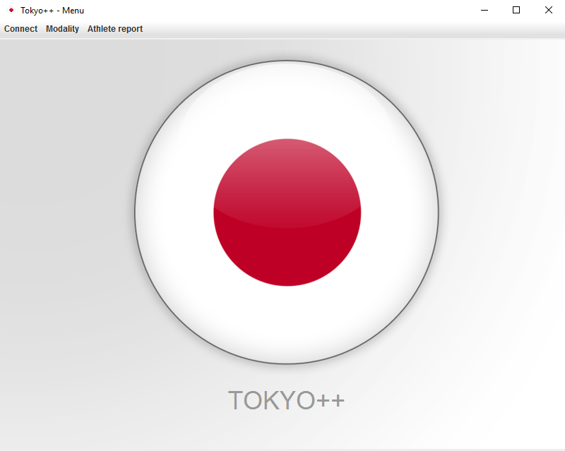
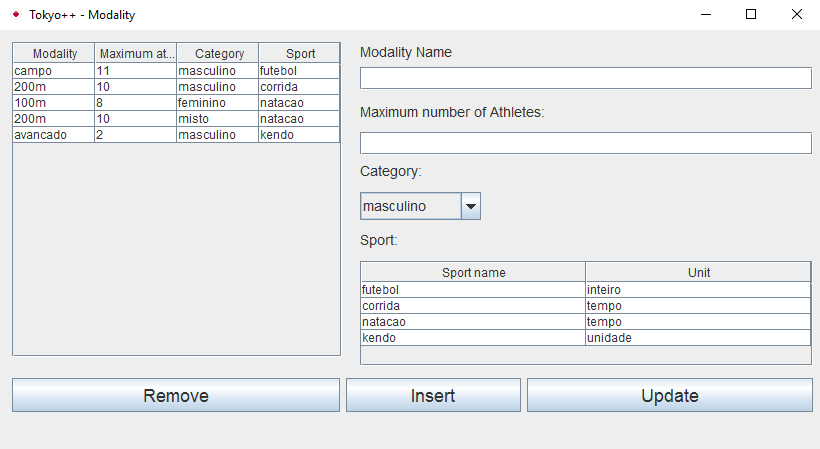
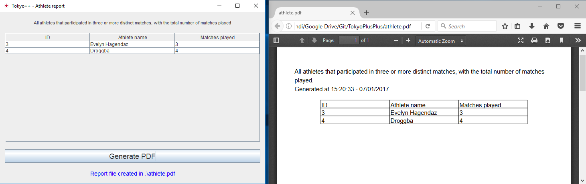

# Tokyo++

Tokyo++ is an application to study Database systems, it was made in the final project in the course of Database.

It features a fictional server for the Tokyo 2020 Olympics.

## Application

The app is made in Java with NetBeans 8.2 and JDK 8.

You can access it in the  [Releases](https://github.com/luanorlandi/TokyoPlusPlus/releases) tab (will require at least Java Runtime Environment 8 to run it).

One of the main functions is the basics operations to alter the server. The user can search, insert, remove and update modalities in the server, always referring to a sport of that modality to maintain consistence.

Another function is a more complex search, as required in the project's specifications: search for "All athletes that participated in three or more distinct matches, with the total number of matches played".

The user can also generate a PDF file with a table of the result.

## Database Server

The connection and data is to a Oracle's server, provided by ICMC - USP to the students during the course of Database.

All SQL scripts used in the project can be access it in the [Script](script) folder.

## Credits

[iText](http://itextpdf.com/) library to handle PDF file.

Members in the project:
- Felipe Kazuyoshi Takara
- Luan Gustavo Orlandi
- Rogiel dos Santos Silva
- Wesley Tiozzo

Guided by Robson Leonardo Ferreira Cordeiro

## License

[MIT](LICENSE)